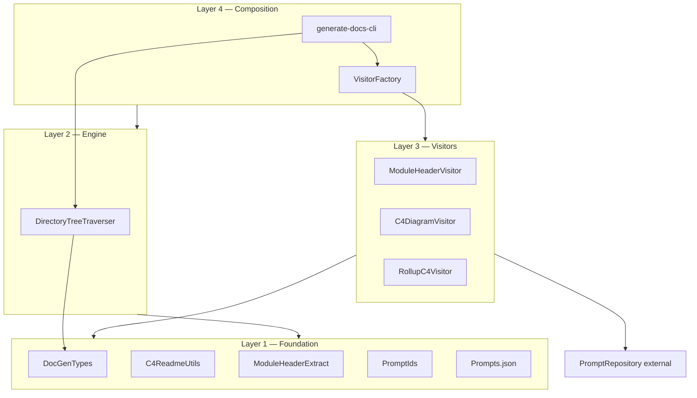

# AutoDoc — Package Design

This document describes how `@jonverrier/auto-doc` is organised: the CLI and traversal engine, the visitor pipeline, dependency rules, and how stages communicate. It is the canonical design reference for this package.

For usage and CLI flags, see [`README.md`](README.md). For agent-oriented notes, see [`AGENTS.md`](AGENTS.md).

---

## Purpose

AutoDoc is a **standalone CLI** that walks a TypeScript source tree and generates architecture documentation:

1. **Module header comments** — LLM-authored summary blocks embedded in each `.ts`/`.tsx` file.
2. **Per-directory C4 markdown** — Component and/or Context Mermaid diagrams in generated markdown files (default: `README.StrongAI.Component.md`, `README.StrongAI.Context.md`).
3. **Optional rollup** — Package-level summaries at the scan root, synthesised from subdirectory docs, root-level module headers, and optional human-authored design intent (`Design.md` / `DESIGN.md`).

The tool never overwrites a project’s hand-written `README.md`.

---

## Design principles

### Visitor pipeline

Processing follows the **Visitor pattern** over a **depth-first directory walk**:

- The **CLI** parses options and wires dependencies.
- **`DirectoryTreeTraverser`** lists each directory, matches files to each visitor’s `fileSpecs`, and calls `visit()` in **ascending `priority`** order.
- After the full tree walk, each visitor’s optional **`finalize()`** hook runs (ascending priority order).

### Visitor independence

**Visitors must not import or call other visitors.** They are independent modules that share only:

| Shared surface | Purpose |
|----------------|---------|
| `DocGenTypes` | `IDirectoryVisitor`, `IDocGenOptions`, I/O abstractions |
| Foundation utilities | Header/README parsing, staleness, output filenames |
| **Filesystem artifacts** | The implicit contract between pipeline stages |
| Injected dependencies | `IFileReader`, `IFileWriter`, `IChatDriver`, `IPromptRepository` |

There is no shared mutable registry and no visitor-to-visitor object graph. **`VisitorFactory`** is the only place that constructs the visitor list.

### Priority order is part of the design

Lower `EVisitorPriority` runs first **within each directory**. Later stages assume earlier stages have already run in that directory (or, for rollup, earlier in the job):

```text
kFirst  → ModuleHeaderVisitor   (refresh source headers)
kSecond → C4DiagramVisitor      (read headers → write per-directory C4 markdown)
kThird  → RollupC4Visitor       (accumulate child READMEs; write root in finalize())
```

**Do not reorder priorities** without updating downstream assumptions. `C4DiagramVisitor` expects current sentinel blocks in source files. `RollupC4Visitor` expects per-directory generated markdown from `C4DiagramVisitor` and fresh root headers from `ModuleHeaderVisitor`.

Cross-directory ordering is defined by **depth-first traversal**: child directories are fully visited (all visitors, all priorities) before siblings complete. Rollup additionally depends on **`finalize()`** running after the entire tree has been walked.

### Filesystem as the integration boundary

Stages communicate through **well-defined file formats**, not through shared in-memory state (except rollup accumulation inside `RollupC4Visitor`, which is private to that visitor):

| Artifact | Writer | Readers |
|----------|--------|---------|
| StrongAI sentinel block in `.ts`/`.tsx` | `ModuleHeaderVisitor` | `C4DiagramVisitor`, `RollupC4Visitor` (via `ModuleHeaderExtract`) |
| Generated C4 markdown with datestamp | `C4DiagramVisitor` | `RollupC4Visitor` |
| Root rollup markdown | `RollupC4Visitor.finalize()` | (human / downstream tools) |

Sentinel and datestamp formats are **compatibility contracts**. Changing them requires coordinated updates to writers and readers (see [Foundation utilities](#layer-1--foundation)).

### Testability

All filesystem and LLM access goes through interfaces in `DocGenTypes`. Unit tests inject mocks; integration tests use real traversal with mocked chat drivers; e2e tests call the real LLM.

---

## Layer model

The package is organised in four layers. Dependencies flow **upward** only (higher layers may use lower; not the reverse).



### Layer 1 — Foundation (contracts and shared utilities)

Pure types, constants, and parsing helpers with **no imports from visitors, traverser, or CLI**.

| Module | Role |
|--------|------|
| `DocGenTypes.ts` | `IDirectoryVisitor`, `IDocGenOptions`, `EVisitorPriority`, I/O interfaces |
| `PromptIds.ts` | UUID constants for prompt lookup |
| `Prompts.json` | In-memory prompt templates (copied to `dist/` at build) |
| `ModuleHeaderExtract.ts` | Sentinel constants, extract/strip/build helpers for source header blocks |
| `C4ReadmeUtils.ts` | Output filenames, validation, README datestamp, staleness helpers (`isArtifactDateStale`, `isReadmeOutputStale`) |

**Dependency rule:** may import `DocGenTypes` only (plus external `@jonverrier/prompt-repository` for errors in validators).

**Compatibility note:** Sentinel strings (`===Start StrongAI Generated Comment (YYYYMMDD)===`, etc.) and README datestamp (`<!-- Generated by StrongAIAutoDoc YYYYMMDD -->`) are **public contracts** between visitors. Centralise changes here; do not duplicate regexes in visitors.

---

### Layer 2 — Engine (traversal)

| Module | Role |
|--------|------|
| `DirectoryTreeTraverser.ts` | Depth-first walk, visitor dispatch by priority, `finalize()` orchestration, `detectSubdirectorySources()` |

**Dependency rule:** may import Layer 1 only. Must not import visitors or `VisitorFactory`.

The traverser sorts visitors once at construction (`priority` ascending) and calls every visitor whose `fileSpecs` match at least one file in the current directory. It does not interpret sentinel or README formats.

---

### Layer 3 — Visitors (pipeline stages)

Each visitor implements `IDirectoryVisitor`, declares its own `priority` and `fileSpecs`, and uses injected I/O + LLM dependencies.

| Visitor | Priority | Output | Skips |
|---------|----------|--------|-------|
| `ModuleHeaderVisitor` | `kFirst` | In-place source header sentinels | Fresh headers (time window) |
| `C4DiagramVisitor` | `kSecond` | Per-directory generated C4 markdown | Stale check; scan root when rollup + nested tree |
| `RollupC4Visitor` | `kThird` | Root rollup markdown in `finalize()` | Flat trees; stale rollup inputs |

**Dependency rule:**

- May import Layer 1 only.
- **Must not import** other visitors, `VisitorFactory`, `DirectoryTreeTraverser`, or `generate-docs-cli`.
- May use `@jonverrier/prompt-repository` for LLM and errors.

**Implicit inputs:** Earlier stages’ filesystem artifacts (see table above). Rollup reads child README paths derived from `getC4OutputFilename()` — same basenames `C4DiagramVisitor` writes.

---

### Layer 4 — Composition (CLI and wiring)

| Module | Role |
|--------|------|
| `generate-docs-cli.ts` | Argument parsing, `IDocGenOptions` assembly, job orchestration |
| `VisitorFactory.ts` | Production `IFileReader`/`IFileWriter`, prompt repo, chat driver, visitor list |

**Dependency rule:** may import all lower layers. This is the only module that constructs the full visitor array.

CLI flow:

1. `parseArgs()` → `IDocGenOptions` (partial; `hasSubdirectorySources` filled next).
2. If `--rollup`: `detectSubdirectorySources()`.
3. `VisitorFactory.createAll(options)` → visitors.
4. `DirectoryTreeTraverser.traverse(options)`.

---

## End-to-end pipeline

```text
CLI parseArgs + optional detectSubdirectorySources
        │
        ▼
VisitorFactory.createAll
        │
        ▼
DirectoryTreeTraverser.traverse(rootDir)
        │
        ├─ for each directory (depth-first):
        │     for each visitor (priority ascending):
        │        visit(dir, matchingFiles, options)
        │
        └─ for each visitor (priority ascending):
              finalize?(options)    ← RollupC4Visitor writes root here
```

### Rollup-specific behaviour

When `--rollup` is set and nested sources exist under `rootDir`:

| Location | ModuleHeaderVisitor | C4DiagramVisitor | RollupC4Visitor |
|----------|--------------------|------------------|-----------------|
| Subdirectories | Yes | Yes (per-dir C4 markdown) | Accumulates child README content |
| Scan root | Yes (headers only) | **Skipped** | Records root files; writes rollup in `finalize()` |

Flat trees (`src/*.ts` only): per-directory C4 at root as usual; rollup is a no-op.

---

## Dependency rules (summary)

```text
Layer 4  CLI, VisitorFactory     → may use 1–3
Layer 3  Visitors                → may use 1; must not import other visitors or Layer 2/4
Layer 2  DirectoryTreeTraverser  → may use 1
Layer 1  Foundation              → no visitor/traverser/CLI imports
```

**Visitor independence rule:** no `./ModuleHeaderVisitor` (etc.) imports anywhere except `VisitorFactory`.

**Priority rule:** new visitors must pick an unused `EVisitorPriority` value and document what filesystem artifacts they consume and produce.

---

## Module index by layer

| Layer | Modules |
|-------|---------|
| 1 | `DocGenTypes.ts`, `PromptIds.ts`, `Prompts.json`, `C4ReadmeUtils.ts`, `ModuleHeaderExtract.ts` |
| 2 | `DirectoryTreeTraverser.ts` |
| 3 | `ModuleHeaderVisitor.ts`, `C4DiagramVisitor.ts`, `RollupC4Visitor.ts` |
| 4 | `generate-docs-cli.ts`, `VisitorFactory.ts` |

Published entry point: `bin` → `dist/generate-docs-cli.js`.

---

## Known tensions (current codebase)

| Tension | Detail |
|---------|--------|
| **Rollup private accumulation** | Only visitor with cross-visit mutable state; acceptable because it does not leak to other visitors. |
| **Priority vs finalize** | `RollupC4Visitor.visit()` runs at `kThird` per directory but output happens in `finalize()`. Order still safe because rollup reads files written by earlier visitors in child dirs during the same job. |

Sentinel markers, header extraction, strip/build helpers, and shared staleness logic are centralised in `ModuleHeaderExtract.ts` and `C4ReadmeUtils.ts` (`isArtifactDateStale`).

---

## Adding a new visitor

1. Implement `IDirectoryVisitor` in Layer 3.
2. Choose `priority` relative to existing stages; document filesystem inputs/outputs.
3. Do not import other visitors.
4. Register in `VisitorFactory.createAll()` when appropriate CLI flags are set.
5. Add unit tests with mocked I/O and chat driver; integration test via traverser if needed.
6. Update this document and `AGENTS.md` pipeline section.

---

## Related packages

| Package | Relationship |
|---------|--------------|
| `@jonverrier/prompt-repository` | LLM drivers, prompt expansion, error classes |
| **AgentDoc** | Interactive MCP sibling; separate repo |
| **Consumer repos** | Dev dependency; `auto-doc` npm script on `./src` |

---

## Maintaining this document

Update `DESIGN.md` when:

- A new visitor or foundation module is added.
- Priority order or filesystem contract changes.
- Rollup or traversal semantics change.

Quick import audit for a new visitor:

```bash
rg "^import " src/YourNewVisitor.ts
```

Confirm no imports from other visitors or from `DirectoryTreeTraverser` / `generate-docs-cli`.
