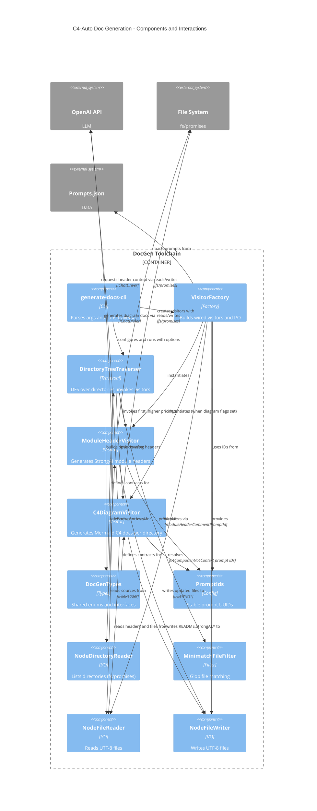

<!-- Generated by StrongAIAutoDoc 20260219 -->

This directory implements a Node-based documentation generator that traverses a codebase, produces per-file AI-authored headers, and composes Mermaid C4 diagrams for each directory. A CLI entry parses options, constructs visitors via a factory, and orchestrates traversal using a depth-first traverser with glob filtering. Visitors read and write files through abstracted I/O, resolve prompt templates, and invoke an LLM to generate content. Shared type definitions unify contracts across modules.

Key components:
- generate-docs-cli: Orchestrates runs. It parses CLI flags, builds IDocGenOptions, wires traversal with visitors, and logs lifecycle events.
- VisitorFactory: Central composition root. It creates Node I/O implementations, loads Prompts.json into an in-memory repository, constructs a chat driver, and returns ModuleHeaderVisitor and, conditionally, C4DiagramVisitor.
- DirectoryTreeTraverser: Depth-first walker that applies MinimatchFileFilter and invokes visitors by priority, ensuring headers precede diagram generation.
- ModuleHeaderVisitor: Reads TypeScript files, detects staleness, resolves the module header prompt, calls the LLM, and rewrites files with updated StrongAI header blocks.
- C4DiagramVisitor: Aggregates per-file headers, manages word budgets and freshness windows, resolves diagram prompts, and writes README.StrongAI.* diagrams.
