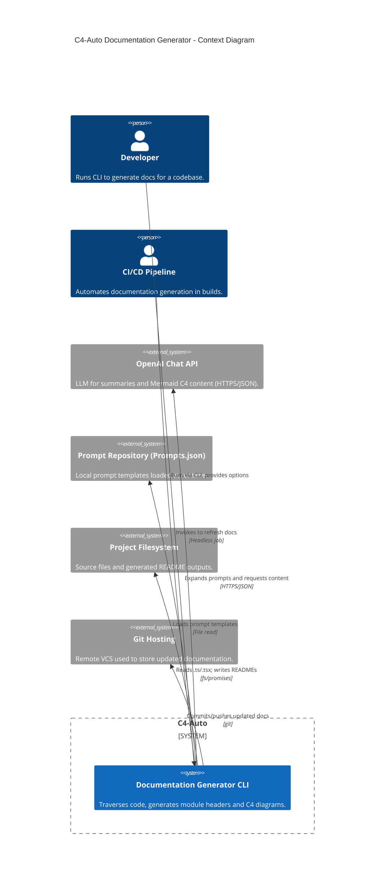

<!-- Generated by StrongAIAutoDoc 20260219 -->

C4-Auto is a command-line tool that automates documentation for TypeScript projects. It parses CLI options, traverses the repository, and uses LLM prompts to produce and refresh module headers and Mermaid C4 diagrams. It interacts with the local filesystem, a prompt repository, and a hosted LLM provider (OpenAI). Developers run it locally or from CI to keep docs current.

Key components and external interactions:
- LLM integration: The Documentation Generator expands prompt templates and calls the OpenAI Chat API to synthesize module headers and Mermaid C4 diagrams.
- Prompt sourcing: Prompts.json is read locally, decoupling prompt content from code.
- Filesystem I/O: Uses Node fs/promises to read TypeScript sources and write generated README.StrongAI.*.md files; staleness windows prevent unnecessary rewrites.
- Orchestration: Directory traversal and visitor execution determine which files and directories are processed, honoring glob filters.
